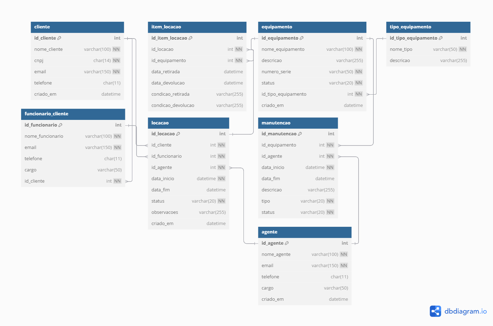
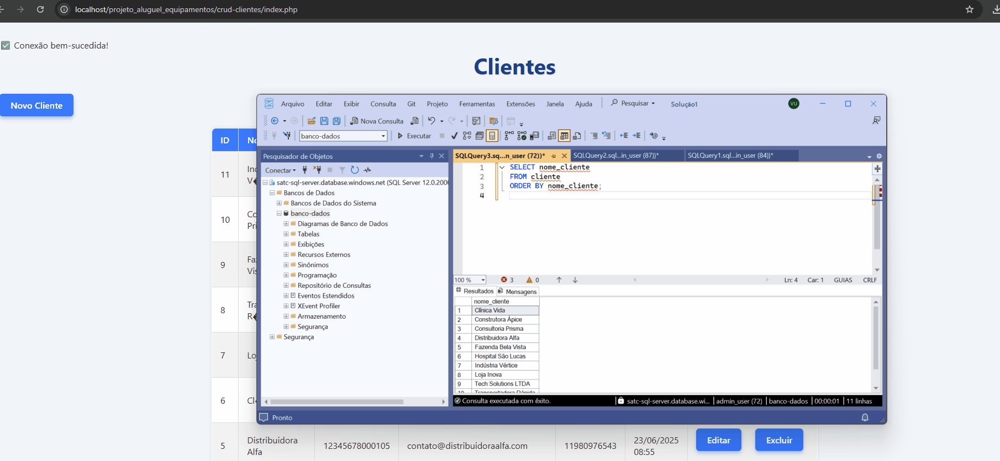

## 📁 Projeto alocação de equipamentos - Grupo C

Este projeto consiste na criação de um **modelo físico de um banco de dados** para um sistema de alocação de equipamento. O projeto foi desenvolvido em **com PHP e SQL server**, criando um **CRUD** para cadastro dos clientes, que são as empresas que contratam nossos serviços de alocação de equipamentos.  

A aplicação realiza a conexão com o banco de dados através de uma biblioteca chamada **Entity Framework**, permitindo operações de **adição**, **atualização** e **deleção** de dados.  
Foram utilizados todos os conceitos e dinâmicas práticas de **SQL** desenvolvidos em aula.

#### 🏢 Sobre a empresa

Somos uma empresa que oferece a alocação de equipamentos e periféricos, como notebooks, monitores, teclados e fones, para outras empresas que precisam montar ou ampliar sua estrutura de trabalho, especialmente em modelos home office ou híbrido. Nosso serviço inclui entrega, retirada, suporte e manutenção dos equipamentos, ajudando os clientes a economizar tempo e reduzir custos com tecnologia, sem abrir mão da qualidade e da organização.

#### 👨‍💻 Integrantes

- Vanessa Ugioni - [vanessaugioni](https://github.com/vanessaugioni)  
- Karine - [karine285](https://github.com/karine285)  
- Gabriel - [gabrieelrrocha](https://github.com/gabrieelrrocha)  
- Sabrina - [sabtl](https://github.com/sabtl)  
- Keller - [Keler1606](https://github.com/Keler1606)  
- Ana Paula - [anapaulagesser](https://github.com/anapaulagesser)  

...

### 🗂 Modelo Físico

Utilizamos a ferramenta de modelagem de dados [dbdiagram.io](https://dbdiagram.io/d/683e357061dc3bf08d3ad679) para criação do modelo físico do banco de dados, para posterior exportação dos scripts DDL das tabelas e relacionamentos.

Arquivo fonte: [Modelo físico](https://dbdiagram.io/d/683e357061dc3bf08d3ad679)

...

### 📖 Dicionário de dados

As informações sobre as tabelas e índices foram documentados na planilha colocar link aqui!!!!!

...

### 💾 Scripts SQL

Para este projeto foi utilizado o banco de dados Azure SQL. 

Abaixo, segue os scripts SQL separados por tipo:

- [Tabelas;](https://github.com/vanessaugioni/projeto_aluguel_equipamentos/tree/main/scripts/ddl/tabelas)
- [Índices;](https://github.com/vanessaugioni/projeto_aluguel_equipamentos/tree/main/scripts/ddl/indices)
- [Gatilhos;](https://github.com/vanessaugioni/projeto_aluguel_equipamentos/tree/main/scripts/ddl/gatilhos)
- [Procedimentos armazenados;](https://github.com/vanessaugioni/projeto_aluguel_equipamentos/tree/main/scripts/ddl/procedimentos-armazenados)
- [Funções;](https://github.com/vanessaugioni/projeto_aluguel_equipamentos/tree/main/scripts/ddl/funcoes)
- [DML;](https://github.com/vanessaugioni/projeto_aluguel_equipamentos/tree/main/scripts/dml)

...

### 💻 Código Fonte do CRUD

Nosso projeto foi desenvolvido utilizando PHP, rodando em um ambiente local configurado com XAMPP, que inclui o servidor Apache e o PHP. Para o banco de dados, utilizamos o Azure SQL, aproveitando a escalabilidade e segurança da plataforma em nuvem da Microsoft. Essa combinação permite um desenvolvimento ágil e a integração eficiente entre a aplicação e o banco de dados.

Passo a passo para rodar local na máquina: 

1. Passo: Instale o XAMPP (Apache + PHP + drivers php); 
2. Passo: Configure o banco Azure SQL e crie a base de dados; 
3. Passo: Instale os drivers sqlsrv no PHP (coloque as DLLs em php\ext e habilite no php.ini); 
4. Reinicie o Apache no XAMPP.
5. Coloque os arquivos do projeto na pasta htdocs.
6. Acesse pelo navegador em http://localhost/projeto_aluguel_equipamentos/crud-clientes/index.php
7. Use o sistema CRUD para gerenciar clientes.

Vídeo de apoio para instalação de drivers: PHP [Instalando Drivers SQLSERVER no Xampp](https://www.youtube.com/watch?v=1XMpFd3WgaQ)

Local: [C:\xampp\htdocs\projeto_aluguel_equipamentos](http://localhost/projeto_aluguel_equipamentos/crud-clientes/index.php)

Aplicação funcional com CRUD:

...

### 🛠️ Ferramentas utilizadas

- Azure SQL;
- SQL Server Management Studio 21; 
- dbdiagram.io; 
- Google docs (relatório final); 
- Google apresentação (slide); 
- XAMPP (desenvolvimento web local)
- Wpp e Meet (Comunicação interna)
- Github (repositório e board de issues)
- Google AI Studio (conferência de dados, resumo e explicações e apoio na conectividade do banco)

...

### 📊 Relatório Final 
O relatório final está disponível no arquivo relatorio-final/template1.docx.

...

### 🎞️ Slides
O slide está disponível [aqui](https://docs.google.com/presentation/d/1xlzyd3S4egT4qjUBe42yQEdRWt5Wgvsq7QVuaO2WYNE/edit?usp=sharing)!

...

### 📚 Referências principais

- Vídeo: [Baixando e instalando o SQL Server Express e o SSMS (SQL Server Management Studio).](https://www.youtube.com/watch?v=BwnemvVholw&list=PLW83fkbt3BqmKH24X2ssolU1nWwIl-DUa)
- Vídeo: [Instalação do SQL Server 2022 e SSMS no Windows](https://www.youtube.com/watch?v=QOXiRS1yWhE)
- Vídeo: [Aprenda git em 30 minutos - os principais comandos git](https://www.youtube.com/watch?v=Zwv9qRyVeU4)
- Vídeo: [12 dicas de Boas Práticas em Modelagem de Dados](https://www.youtube.com/watch?v=ppA649f48e8) | Ví só algumas partes
- Vídeo: [Instalando Drivers SQLSERVER no Xampp](https://www.youtube.com/watch?v=1XMpFd3WgaQ)
- Site: [O que é a normalização de bases de dados e como fazê-la?](https://ebaconline.com.br/blog/normalizacao-de-bases-de-dados)
- Site: [Índices clusterizados e não clusterizados](https://learn.microsoft.com/pt-br/sql/relational-databases/indexes/clustered-and-nonclustered-indexes-described?view=sql-server-ver17)
- Site: [Otimizando o SQL Server: Compreendendo loops aninhados, correspondência de hash, junção de mesclagem e junção adaptável](https://rafaelrampineli.medium.com/optimizing-sql-server-joins-understanding-nested-loops-hash-match-merge-join-and-adaptive-join-5ba57fcf6ec3)
- Material: [Slides da aula (quase todos com script)](https://www1.satc.edu.br/portais/alunos/index.php/conteudos/exibir_conteudo?i_classe=MkY1RGtuRjB6ekwzaWI5Nzd6djc3dlNSQjRYbjhZSlJaN3REblR6cFRLV08vMTBZWkJ4TlQvSURuTmFVOEF5Y1ZUZjJVTUpLR1pxcTBMK2pHN1MxUXc9PQ==&i_conteudo=em9DTTdFLzh3RVVuVmtnbFpZN0tRL3oxT1psc215ZFppNXU4dk9jQ2lVRlcxOFlZejQzMklHM1pGQ0VJTW1ZWlRwUnlhZXRwTzBxblovSDMwUU9SakE9PQ==)
